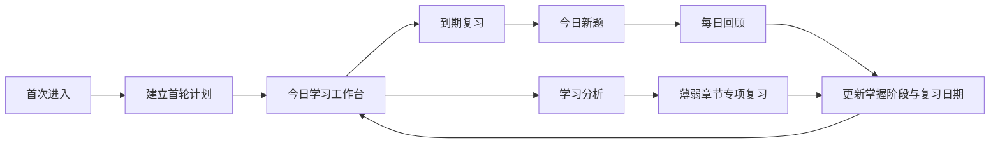
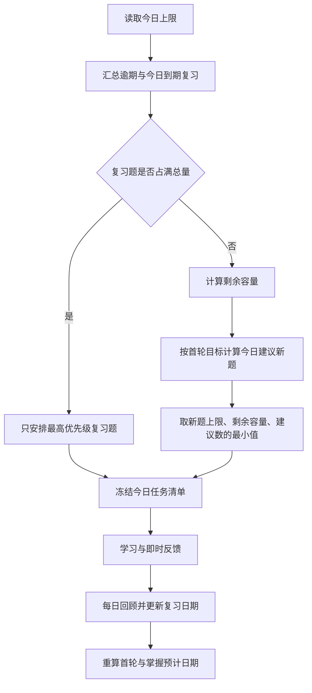

# 学习规划系统功能与设计方案

> 状态：待用户最终确认后进入实现
> 日期：2026-08-10
> 适用项目：刷题助手纯前端 Web 应用

## 1. 功能摘要

本功能把现有“用户自己选择章节和范围”的纯刷题应用，升级为一个完整的个人学习闭环：用户为整套 860 道机械考研题设置首轮完成日期、每日新题上限和每日总题量上限；系统每天优先安排到期复习，再安排新题，并根据真实完成情况自动调整预计日期。

计划学习采用逐题即时反馈。系统用客观正误、复习间隔和每日结束时集中勾选的“不熟练题”计算题目掌握阶段；模拟考试继续整卷提交。分析统一以现有章节为主要粒度，输出薄弱章节、错误趋势、周期复盘和可直接执行的下一步建议。

本功能不引入账号、后端、云同步、AI 内容生成、知识点内容卡片或社交打卡体系。

### 1.1 与现有 PRD 的关系

现有 `PRD.md` 将“智能学习计划”列为非目标，并把趋势、掌握状态和复习计划放在 P2。本方案确认后，实现阶段应同步修订这些条目，将本文定义的学习规划系统纳入正式产品范围；现有章节练习、模拟考试、错题、收藏、搜索、题库管理和离线能力继续保留。

## 2. 核心用户动作

用户进入应用后最重要的动作是：**看懂今天的复习题、新题和总量，然后开始今日学习。**

首页必须优先回答四个问题：

1. 今天有多少到期复习题？
2. 今天安排多少新题？
3. 总量是否符合我设置的上限？
4. 按当前节奏，首轮预计什么时候完成？

章节浏览、模拟考试、错题集和详细分析仍然重要，但不能抢占今日任务的第一视觉层级。

## 3. 设计方向

### 3.1 视觉策略

- 色彩策略：`Restrained`。延续现有 `#007c72` 主色、`#4fd1c5` 品牌青、冷灰背景、白色内容面和现有语义状态色。
- 默认主题：浅色。场景是备考者在较明亮的室内书桌前，用平板横屏连续学习 60–90 分钟；系统仍保留现有深色主题供夜间使用。
- 字体与组件：继续使用 Inter、Microsoft YaHei 和系统字体；沿用 8/12/16px 圆角、44px 触控目标、Material Symbols 和 150–250ms 状态动效。
- 信息表达：用对齐、分隔线、进度条和列表建立层级，避免用大量同质卡片包装每个数字。

### 3.2 已确认的视觉探针

最终方向采用：

- 方向 A 的“今日任务优先”结构：到期复习、新题、总量和开始按钮最醒目。
- 方向 B 的“计划节奏”信息：显示原目标日期、当前预计日期和未来 7 天稳定负担。
- 方向 C 的详细周趋势不放在首页，移入独立分析页；首页只保留薄弱章节 Top 3 和快捷复习入口。

视觉探针仅用于验证方向，不是最终 UI 规格，也不作为项目运行资产。

### 3.3 设计锚点

- 当前刷题助手章节页：品牌、侧栏、密度和组件语言的基准。
- 已确认的方向 A：今日任务的层级基准。
- 已确认的方向 B：计划时间线和负担预览的基准。

## 4. 方案范围

| 维度 | 范围 |
|---|---|
| 完成度 | 面向正式上线的完整方案，不是临时原型 |
| 页面范围 | 计划建立、今日工作台、计划学习、每日回顾、学习分析、计划设置共 6 个核心界面 |
| 交互范围 | 完整可操作流程，包含首用、恢复、空状态、积压、延期、首轮完成和存储异常 |
| 终端 | 平板横屏优先，同时保持桌面、平板竖屏和手机可用 |
| 技术 | 原生 HTML/CSS/JavaScript、localForage/IndexedDB、Service Worker；不增加框架、构建工具或后端 |
| 数据 | 现有 860 题及之后导入的题；旧错题作为初始薄弱信号，新版启用后开始准确记录 |

## 5. 信息架构与布局策略

### 5.1 一级导航

桌面和平板横屏侧栏调整为：

1. 今日学习
2. 章节练习
3. 模拟考试
4. 学习分析
5. 错题集
6. 收藏集
7. 题目搜索
8. 题库管理

手机底部导航保持 5 项，建议为：

1. 今日
2. 练习
3. 考试
4. 错题
5. 更多

“学习分析、收藏、搜索、题库管理”在手机端进入“更多”；今日页中的薄弱章节入口也可直达学习分析。

### 5.2 主流程

### 5.3 首页空间结构

平板横屏采用“A 为主、吸收 B”的单主线结构：

1. 页面标题与计划设置入口。
2. 今日任务主区域：到期复习、新题、总量、预计时长、唯一主按钮。
3. 首轮进度条：完成数/总数、原目标日期、预计完成日期、延期说明。
4. 今日任务明细：优先显示复习，再显示新题；按章节分组但保持为连续列表。
5. 辅助区域：薄弱章节 Top 3，只展示结论和“复习”动作。
6. 未来 7 天负担预览：展示每日预计总量，不做大型图表。

首页不展示完整周趋势、复杂掌握图谱或多组并列指标；这些进入学习分析页。

## 6. 核心页面

### 6.1 建立首轮计划

#### 页面目标

让用户用一次简单设置建立覆盖整套题库的计划，并在保存前看懂目标是否可实现。

#### 输入项

- 计划范围：固定显示“当前整套题库，共 860 题”，不提供章节多选。
- 首轮目标日期：表示全部题至少学习一次的目标日期。
- 每日新题上限：正整数，且不能大于每日总题量上限。
- 每日总题量上限：新题与复习题合计上限。

#### 实时反馈

- 剩余自然日。
- 为按期完成所需的平均新题数。
- 按当前上限模拟出的预计首轮完成日期。
- 若目标不可达，直接说明“按当前上限预计在 X 月 X 日完成”，不强制提高每日题量。

#### 默认建议

- 建议新题数：`ceil(未学习题数 / 剩余天数)`，但不替用户自动突破上限。
- 建议总题量：在新题建议上预留复习容量；只作为建议值，用户可调整。
- 校验范围建议为新题 1–200、总量 1–300，且新题上限不大于总量上限。

计划设置使用独立页面或大面积内联区域，不使用狭窄弹窗。

### 6.2 今日学习工作台

#### 主区域

- 到期复习题数。
- 今日新题数。
- 今日总量与上限。
- 预计用时，使用近期个人平均速度估算；数据不足时显示题量而不伪造时长。
- 主按钮：“开始今日学习”或“继续今日学习”。

#### 计划节奏

- 首轮进度：`已完成 / 当前计划题数`。
- 原目标日期与预计完成日期并列。
- 延期时显示原因：“为保持每日上限，预计完成日期顺延 8 天”。
- 未来 7 天只显示预计总题量；这些数字是模拟值，不承诺未来复习量绝对不变。

#### 薄弱摘要

- 只显示 3 个已学习且样本充分的薄弱章节。
- 每项显示章节名、掌握度、近 30 天正确率和“复习”动作。
- 未学习章节不标记为薄弱，而归入覆盖进度。

### 6.3 计划学习页

#### 模式差异

- 计划学习：逐题即时判分。
- 模拟考试：继续整卷交卷后统一判分。
- 章节练习、错题重练和收藏练习：保留现有模式；其结果进入统计，但不因一次额外答对而推迟已经安排好的复习。

#### 逐题流程

1. 用户作答。
2. 系统锁定本题答案并立即显示正确/错误。
3. 显示正确答案；有解析时显示解析，没有解析时不制造空白模块。
4. 用户点击“下一题”。单选题在计划模式下不再答完自动跳题，避免看不到即时反馈。
5. 先完成到期复习，再进入新题；顶部进度明确区分两个阶段。

#### 中断与恢复

- 每题判分后立即保存结果和当前位置。
- 刷新或重新打开应用时允许继续未完成的今日计划。
- 退出时说明“已完成结果已保存，未完成题会在下次继续或自动顺延”。

### 6.4 每日回顾

#### 页面目标

用一次集中操作补充主观感受，不要求用户每题选择熟练度。

#### 页面结构

- 今日结果摘要：完成数、正确率、复习/新题拆分。
- “系统已记录”：所有答错题自动列入薄弱，不允许取消。
- “还有哪些题感觉不熟练？”：只列出当天答对的题，默认全部未勾选。
- 提供章节筛选和题干摘要，便于从典型 40–80 道题中快速选择。
- 操作：“完成今日学习”；若未勾选任何题，表示其余正确题主观上默认熟练。

用户跳过回顾或直接关闭页面时，也按默认规则完成：答错题薄弱，答对题默认熟练。

### 6.5 学习分析

#### 页面目标

回答“哪里薄弱、最近是否改善、下一步做什么”，而不是展示尽可能多的数据。

#### 模块

1. 时间范围：近 7 天、近 30 天、全部。
2. 总体进度：题库覆盖率、整体掌握度、到期/逾期数量。
3. 章节排名：章节覆盖率、掌握度、正确率、逾期率和趋势。
4. 错误趋势：按天或周显示错误率变化，区分复习题与新题。
5. 周期复盘：本周期完成题数、计划完成率、掌握提升、反复错误章节。
6. 下一步建议：使用本地规则生成一句到三句可执行建议，并提供对应按钮。

详细分析使用一张趋势图加若干对齐列表，不使用大量同尺寸指标卡。

### 6.6 计划设置

- 修改目标日期、新题上限、总题量上限。
- 暂停/继续计划；暂停期间不生成每日任务，恢复时重新计算预计日期。
- 查看当前题库纳入计划的数量。
- 重建计划：保留学习历史，只重新生成未来任务。
- 清空学习档案：危险操作，必须二次确认，并明确不会删除题库、错题和收藏。

## 7. 关键页面状态

| 状态 | 用户需要看到的内容 | 处理方式 |
|---|---|---|
| 尚未建立计划 | 整套题库数量、功能说明、建立计划按钮 | 进入完整设置页，不显示空仪表盘 |
| 数据加载 | 今日任务与进度的骨架屏 | 不在页面中央使用阻塞式转圈 |
| 正常今日任务 | 复习、新题、总量、进度、开始按钮 | 唯一主操作为开始/继续 |
| 复习量超过上限 | “今天先处理复习，新题暂缓”及剩余积压 | 总量不突破上限，积压顺延 |
| 今日无任务 | “今天没有到期任务”及下次复习日期 | 可进入自由练习，但不伪造计划任务 |
| 多日未学习 | 积压数量、今日上限、更新后的预计日期 | 不补齐历史每天任务，不突然增加负担 |
| 首轮完成 | “860 题已完成首轮”及后续到期复习 | 计划继续运行，不把产品变成完成后空页 |
| 全部达到掌握 | 安静的完成提示、维持复习日期 | 不使用夸张庆祝或游戏奖励 |
| 新导入题目 | 新增数量、是否已自动纳入计划、日期变化 | 默认自动纳入整套计划，可在设置中查看 |
| 题目被删除 | 从未来任务移除，历史统计保留题目 ID 占位 | 不导致今日任务崩溃 |
| 本地保存失败 | 哪些结果尚未保存、重试和导出建议 | 不允许静默丢失学习记录 |
| 存储空间不足 | 停止写入新记录、提供备份和清理说明 | 不删除用户数据自救 |
| 离线 | 轻量显示“离线可用” | 核心计划与学习继续工作 |

## 8. 交互模型与每日排题

### 8.1 每日排题流程

### 8.2 任务选择规则

#### 复习题排序

1. 逾期天数更长的题优先。
2. 同日到期时，掌握阶段更低的题优先。
3. 最近答错或当天被标记不熟练的题优先。
4. 仍相同时按题库原顺序稳定排列，避免任务每天随机跳动。

#### 新题排序

- 按现有资料、章节和题号顺序推进，保持知识结构连续。
- 每日任务可以同时包含复习和新题，但执行顺序为“复习块 → 新题块”。
- 新导入题目默认按其资料与章节位置纳入尚未学习队列。

#### 每日数量

设每日新题上限为 `N`，每日总题量上限为 `T`：

- `reviewCount = min(到期及逾期复习数, T)`
- `remainingCapacity = T - reviewCount`
- `neededNew = ceil(未学习题数 / 首轮目标剩余天数)`
- `newCount = min(N, remainingCapacity, neededNew)`

目标日期已过或按上限无法完成时，`newCount` 仍不突破用户上限；系统更新预计完成日期，而不是提高每日负担。

#### 未完成与跨日

- 未完成复习题保持到期状态，次日继续按优先级进入队列。
- 未完成新题仍为未学习，但在次日新题队列中优先。
- 每天只生成一份实际任务记录；跳过的日期不补建虚假任务。
- 已开始但跨过午夜的会话允许继续，结果归入会话开始日；下一份任务在当前会话结束后生成。

## 9. 掌握度与记忆复习模型

### 9.1 设计原则

- 不使用需要逐题选择“困难/简单”的完整 SM-2 或 FSRS 交互。
- 不把一次答对等同于掌握。
- 主观默认熟练不能覆盖客观错误。
- 算法必须确定、离线、可解释并可通过固定日期测试。

### 9.2 掌握阶段

| 阶段 | 用户标签 | 题目分值 | 正常下次间隔 |
|---:|---|---:|---:|
| 0 | 未学习 | 0 | 不适用 |
| 1 | 初识 | 20 | 1 天 |
| 2 | 学习中 | 40 | 3 天 |
| 3 | 巩固中 | 60 | 7 天 |
| 4 | 基本掌握 | 80 | 14 天 |
| 5 | 已掌握 | 100 | 30 天；之后答对可延长至 60 天 |

阶段分值用于聚合统计，不应在题目详情中伪装成精确概率。

### 9.3 阶段变化

- 首次作答后进入阶段 1，无论正误都不会直接跳过第一次短间隔复习。
- 计划内复习答对且未标记不熟练：阶段加 1，最高为 5。
- 计划内复习答对但每日回顾标记不熟练：阶段不提升，下次间隔使用当前阶段的前一档，最短为次日。
- 答错：阶段降低 2 档但最低保留为 1，次日复习。
- 阶段 5 再次按期答对：保持阶段 5，间隔延长至 60 天。
- 模拟考试或自由练习答错：记录错误并把复习日期提前到次日，同时阶段降低 1 档。
- 模拟考试或自由练习答对：进入统计，但不把已经安排好的复习推迟，避免通过额外刷题绕过间隔验证。

### 9.4 汇总指标

- 题库覆盖率：至少作答过一次的题数 / 当前计划题数。
- 整体掌握度：全部计划题阶段分值的平均值，未学习题按 0 计。
- 已学习题掌握度：只对已学习题计算，用于区分“没学到”和“学了但薄弱”。
- 章节掌握度：章节内全部题阶段分值平均值，同时显示章节覆盖率。
- 已掌握题数：阶段 5 的题数。

## 10. 薄弱统计与建议规则

### 10.1 薄弱章节

未学习章节不称为薄弱。只有至少学习 5 题的章节进入薄弱排名；样本不足时显示“数据积累中”。

薄弱分建议按以下可解释规则计算：

- 50%：已学习题掌握度不足。
- 30%：近 30 天错误率。
- 20%：已学习题中的逾期比例。

对应表达式：

`薄弱分 = 0.5 × (100 - 已学习题掌握度) + 0.3 × (100 - 近30天正确率) + 0.2 × 逾期比例`

分数只用于排序；界面主要展示掌握度、正确率和逾期题数，不把综合分当作考试成绩。

### 10.2 趋势

- 近 7 天按天聚合。
- 近 30 天按天或周聚合，取决于有效学习天数。
- 全部历史按周聚合。
- 区分新题正确率与复习题正确率。
- 没有作答的日期显示无数据，不按 0% 计算。

### 10.3 下一步建议

建议完全由本地规则生成，不调用 AI：

1. 有逾期任务：优先完成今日复习。
2. 某章节样本充足且掌握度持续低于 60：建议专项复习该章节。
3. 新题推进速度不足导致首轮延期：说明延期天数并建议调整日期或上限，但不自动改值。
4. 复习正确率上升且逾期为零：建议保持当前节奏。
5. 首轮完成：把下一阶段目标切换为“提高已掌握题数”。

每条建议必须带可执行入口，如“开始今日复习”“复习：链传动”“调整计划”。

## 11. 日期预测

### 11.1 首轮预计完成日期

使用当前题目状态、未来已知复习日期、每日新题上限和总量上限逐日模拟，直到全部题至少进入阶段 1。每次完成任务、修改计划、导入/删除题目或跨日时重算。

首页同时保留：

- 原目标日期：用户设置，除非用户主动修改，否则不变。
- 预计完成日期：系统模拟结果，允许自动顺延。

### 11.2 预计掌握日期

- 至少积累 3 个有效学习日后再显示。
- 基于当前阶段、到期队列、每日上限和近期正确率模拟；明确标注为“按当前表现预计”。
- 模拟假设不是承诺；若预测跨度超过一年，显示“超过一年”而不是伪造精确日期。
- 全部题达到阶段 5 时，进入维持复习，不停止计划。

## 12. 数据模型与持久化

### 12.1 新增持久化键

| 键 | 内容 |
|---|---|
| `studyPlan` | 单一整库计划、目标日期、每日上限、状态、纳入题目 ID |
| `questionProgress` | 每题掌握阶段、次数、最近结果、下次复习日期和短期结果序列 |
| `dailyStudyRecords` | 按日期保存实际任务、结果、不熟练标记和章节聚合 |
| `activeStudySession` | 未完成计划学习的题目顺序、当前位置和已判分结果 |
| `studySettings` | 学习数据版本、预测缓存时间等内部设置 |

不保存长期原始用户答案；趋势和掌握计算只需要题目 ID、模式、正误、日期和不熟练标记。结果页仍可在当前会话内显示用户答案。

### 12.2 `studyPlan`

| 字段 | 说明 |
|---|---|
| `id` | 固定单计划 ID |
| `createdAt` / `startedAt` | 建立与开始时间 |
| `targetFirstPassDate` | 用户原目标日期 |
| `newQuestionLimit` | 每日新题上限 |
| `totalQuestionLimit` | 每日总量上限 |
| `status` | `active`、`paused`、`firstPassComplete`、`maintenance` |
| `enrolledQuestionIds` | 当前纳入整库计划的题目 ID |
| `originalQuestionCount` | 建立计划时题量，仅用于解释变化 |

### 12.3 `questionProgress[questionId]`

| 字段 | 说明 |
|---|---|
| `stage` | 0–5 掌握阶段 |
| `firstSeenAt` / `lastAttemptAt` | 首次与最近作答日期 |
| `nextReviewAt` | 下次到期日期 |
| `intervalDays` | 当前间隔 |
| `attemptCount` / `correctCount` / `wrongCount` | 累计统计 |
| `correctStreak` | 连续正确次数 |
| `recentResults` | 最近最多 5 次的日期、模式与正误 |
| `lastMode` | 最近作答来源 |
| `subjectiveUnfamiliarAt` | 最近一次被标记不熟练的日期 |
| `legacyWrongCount` | 迁移前错题次数，只作初始信号与说明 |

### 12.4 `dailyStudyRecords[date]`

- 计划复习数、新题数和总量。
- 每题任务类型：`review`、`new`、`carry`。
- 每题状态：未完成、答对、答错、额外标记不熟练。
- 当日新题/复习正确率。
- 章节级完成与正误聚合。
- 完成时间和是否跳过回顾。

典型 40–80 题、上限 300 题；应使用分段渲染或分页回顾，避免一次性构建过多 DOM。

## 13. 旧数据迁移与备份

### 13.1 数据迁移

- 学习数据版本新增为独立版本，不复用题库 `dbVersion` 的语义。
- 旧 `errorBook` 中的题目初始化为阶段 1、下次复习日期为计划建立当天，并写入 `legacyWrongCount`。
- 不为旧错题伪造具体作答历史或正确率。
- 其他题目初始化为阶段 0。
- 旧错题集继续可用；新版作答同时维护其兼容数据。

### 13.2 题库变化

- 导入新题：默认加入整库计划并重算预计日期。
- 更新同一题目 ID：保留原学习进度。
- 删除题目：从未来计划移除，历史日记录保留题目 ID 占位。
- 恢复备份时题库与学习状态按题目 ID 对齐，孤立进度不进入当前计划。

### 13.3 备份

完整 JSON 备份新增：

- `studyPlan`
- `questionProgress`
- `dailyStudyRecords`
- `studySettings`

不导出临时 `activeStudySession`，或在导出前明确询问是否包含未完成会话。旧版备份缺少学习字段时仍可导入，并按迁移规则初始化。

首页或题库管理页在连续学习 7 天且从未备份时给出一次轻量提醒；不反复弹窗。

## 14. 内容要求

### 14.1 关键文案

- 首次设置：“建立首轮计划”
- 主操作：“开始今日学习” / “继续今日学习”
- 复习挤占新题：“今天到期复习较多，新题已减少到 6 题。”
- 日期顺延：“为保持每日总量不超过 40 题，预计完成日期顺延至 9 月 28 日。”
- 每日回顾：“还有哪些题虽然答对了，但感觉不够熟练？”
- 首轮完成：“860 题已全部完成首轮。接下来按期复习，逐步提高已掌握题数。”
- 数据不足：“完成至少 3 个学习日后显示掌握日期预测。”
- 本地风险：“学习记录保存在当前设备，建议定期导出完整备份。”

文案应陈述事实，不用羞耻、焦虑或打卡连续天数施压。

### 14.2 视觉资产

本功能不需要新增插画、摄影或生成式图片。使用现有 Material Symbols、进度条、语义色和原生图表即可；图表应由 HTML/SVG/Canvas 根据真实数据绘制。

## 15. 响应式与可访问性

### 平板横屏与桌面

- 首页今日任务区与薄弱摘要可形成主次双列；任务区始终更宽。
- 未来 7 天预览使用横向等分，但允许在较窄平板上滚动或换行。
- 计划学习保持题目内容与题号导航并列。

### 平板竖屏与手机

- 所有双列结构改为单列，顺序为今日任务、首轮进度、任务明细、薄弱摘要、未来负担。
- 底部主操作可使用安全区内的粘性操作栏，但不能遮挡题目或回顾列表。
- 图表提供文字摘要；横向图表允许有标签的可访问滚动区域。

### 无障碍

- 触控目标至少 44 × 44px。
- 正误、掌握、到期和趋势同时使用文字、图标或形状，不仅依赖颜色。
- 进度条提供 `aria-valuenow`、`aria-valuemin`、`aria-valuemax` 和可读标签。
- 趋势图提供文字摘要或隐藏数据表。
- 所有设置校验与存储错误关联到具体控件并可被屏幕阅读器宣读。
- 减少动态效果时取消数值滚动、进度动画和页面过渡，仅保留即时状态切换。

## 16. 技术组织建议

保持原生架构，但把纯算法从现有大型 `app.js` 中分离：

| 文件 | 职责 |
|---|---|
| `study-engine.js` | 无 DOM 的排题、阶段变化、指标聚合、日期模拟和迁移函数 |
| `app.js` | 导航、页面渲染、题库与现有答题流程集成 |
| `stitch-ui.css` | 新页面与组件样式，继续使用现有 token |
| `index.html` | 新导航入口与脚本加载顺序 |
| `sw.js` | 缓存新增脚本并升级缓存版本 |
| `tests/study-engine.test.js` | 使用 Node 内置测试能力验证纯函数和固定日期场景 |

`study-engine.js` 应允许注入“今天”的日期，避免算法直接散布 `new Date()`，从而可靠测试跨日、逾期和预测。

## 17. 分阶段实施

### 阶段 A：数据与算法地基

- 新增学习数据版本和迁移。
- 完成题目进度、每日记录和活动会话模型。
- 实现纯函数：阶段变化、到期排序、每日排题、日期预测、章节聚合。
- 扩展完整备份与恢复。
- 用 Node 测试覆盖日期和容量边界。

### 阶段 B：今日工作台与计划学习

- 新增计划建立、今日学习和计划设置页面。
- 把计划模式改为逐题即时判分。
- 保存活动会话并支持刷新恢复。
- 完成任务顺延和预计日期变化提示。

### 阶段 C：每日回顾与记忆复习

- 完成自动错误归类和集中不熟练选择。
- 接通掌握阶段与下次复习日期。
- 完成首轮完成与维持复习状态。

### 阶段 D：分析与周期复盘

- 实现章节掌握度、覆盖率、近 7/30 天趋势和薄弱排名。
- 完成本地规则建议及快捷复习入口。
- 增加预计掌握日期。

### 阶段 E：生产硬化

- 平板横屏、平板竖屏、手机和桌面全流程验证。
- 存储失败、题库变化、旧备份、跨日和长时间数据测试。
- Service Worker、离线和缓存升级验证。
- 对照本文验收标准完成视觉与无障碍检查。

## 18. 验收标准

### 计划与排题

- 用户能为当前整套题库创建唯一学习计划。
- 每日新题不超过新题上限，每日总量不超过总量上限。
- 到期和逾期复习优先；复习占满总量时当天不安排新题。
- 未完成任务不会提高次日上限，预计日期会自动顺延。
- 新题按资料、章节和题号稳定推进。

### 学习与掌握

- 计划学习逐题显示正误和正确答案，模拟考试仍统一交卷。
- 每日结束只需勾选额外不熟练题，未勾选的正确题默认熟练。
- 答错题无法被默认熟练覆盖，并在次日进入复习。
- 经过间隔复习多次答对后才能进入“已掌握”。
- 刷新后可以恢复未完成计划学习。

### 分析

- 能分别展示覆盖率、整体掌握度和已学习题掌握度。
- 薄弱章节不把未学习内容误判为薄弱。
- 近 7 天、近 30 天和全部趋势不把无学习日期按 0% 统计。
- 每条建议都能跳转到可执行动作。

### 数据与兼容

- 旧错题被作为初始薄弱信号，但不生成虚假历史正确率。
- 旧版备份可以导入，新版备份包含学习数据。
- 导入新题、更新题目和删除题目后，计划与历史保持一致。
- 核心计划、学习和分析在离线环境可用。

### 体验与无障碍

- 平板横屏能在首屏看清今日任务、首轮进度、预计日期和主操作。
- 手机端不出现横向页面溢出，主操作不遮挡内容。
- 所有主要操作满足 44 × 44px 触控尺寸。
- 键盘、屏幕阅读器和减少动态效果用户可以完成核心计划流程。

## 19. 实现期间推荐使用的界面规范

- `layout.md`：约束首页主次结构、列表密度和响应式重排。
- `adapt.md`：重点验证平板横/竖屏与手机底部导航。
- `harden.md`：覆盖跨日、存储失败、迁移和题库变化。
- `clarify.md`：校准延期、积压、掌握度和本地备份文案。
- `polish.md`：上线前统一交互状态、视觉节奏和无障碍细节。

## 20. 未决问题

核心产品与算法规则已经确认，当前没有阻塞实现的未决问题。本文仍需用户做一次最终确认；确认后才能进入代码实现。
